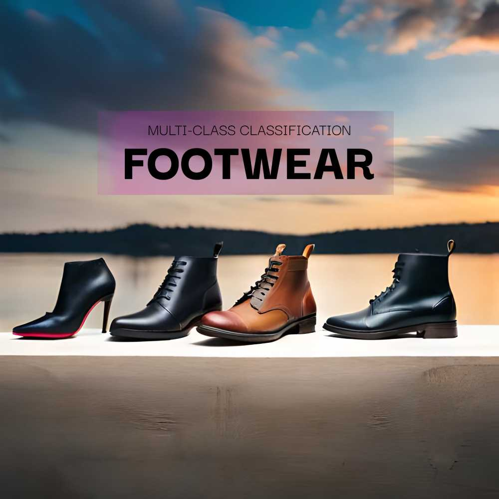

# Multi-class classification of footwear images

Project for machine learning class at ITM.

## Requirements

This project requires Python 3.9.

Main dependencies:

- numpy==1.24.3
- opencv-python==4.7.0.72
- scikit-learn==1.2.2
- torch==2.0.1
- torchvision==0.15.2
- matplotlib==3.7.1

For data preprocessing:
- imagededup==0.3.2

## Dataset

To get started, follow these steps:

- Download the dataset zip file from [this link](https://drive.google.com/file/d/1fQ1odj-YURjW1nYl2fEhMscqZV-J2Of-/view?usp=share_link)
- Extract the contents of the zip file to the `machine-learning-itm-project/data/`	 directory.

## Trained model

To use the pre-trained model for inference, please perform the following steps:

- Download the model from [this link](https://drive.google.com/file/d/1Z5OsrMzKxzogTYikp4o_pQodHUUucAvE/view?usp=share_link)
- Move the downloaded model file to the `machine-learning-itm-project/models/` directory.

## Inference on a single image

Before running the inference code, ensure that all the dependencies are installed and the trained model is downloaded and placed in the correct location.

The code for inference can be found in the `machine-learning-itm-project/src/inference.py` file.

Execute the following comand on the terminal:

	python src/inference.py --checkpoints_path=models/model_acc76.pth --image_path=data/footwear/sneakers/sneakers10.jpg --device=cpu

Please adjust the `checkpoints_path` and `image_path` arguments as needed, specifying the paths to the trained model and the image you want to perform inference on. Also, ensure that the device argument is set correctly for your system (cpu or gpu).

## Results

The model achieves 76.8% accuracy on validation set. The confusion matrix was calculated using the validation set (10% of dataset).

